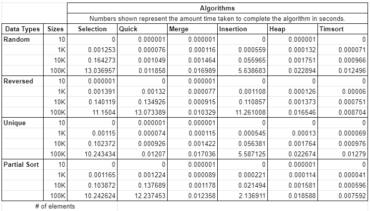
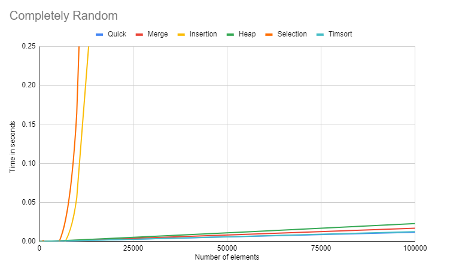
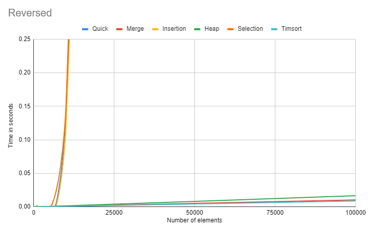
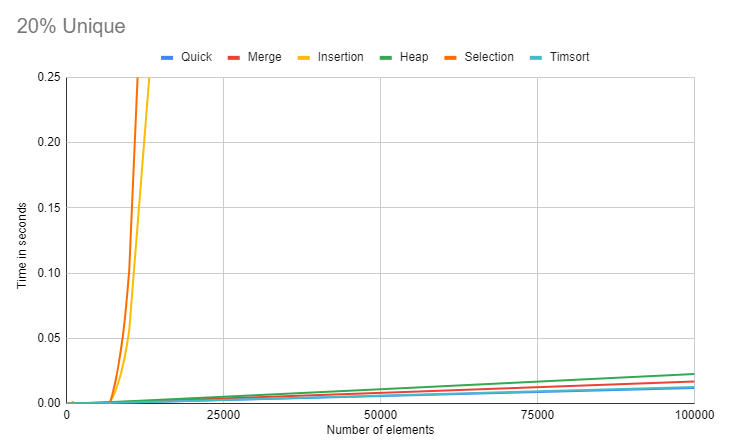
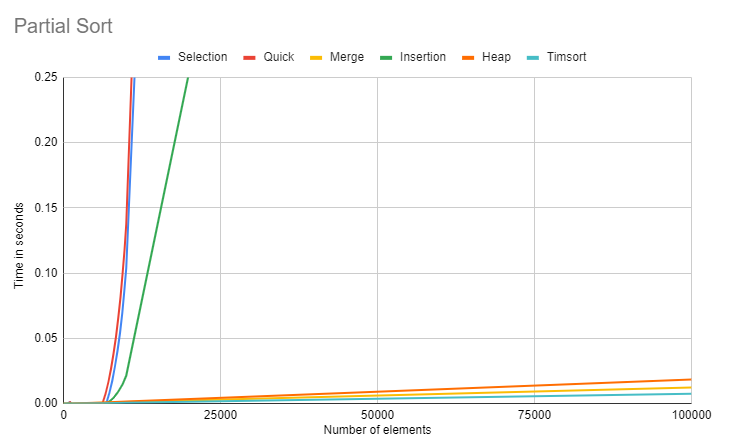

# CS 3353 Programming Project 2
This repository was created and maintained by Kirk Watson.

Student ID: 47876885

Email: klwatson@smu.edu

## Functionality
This program tracks the speed of 6 different sorting algorithms while being used on data sets of different sizes and unique characteristics.
The 6 sorting algorithms are Selection Sort, Quick Sort, Merge Sort, Insertion Sort, Heap Sort, and Timsort.
There are 4 different data set generation types: completely random, reversed sorted order, 20% unique values, and 30% randomized.
The data sets vary in sizes 10, 1K, 10K, 100K, 1M. In the timed tests, the sorting algorithms only sort up to 100K.
Once the data sets are generated, the program will run all data sets through each sorting algorithm and display the times to complete them.

## How to Use
This program does not take any arguments or input files.
Simply compile and run to generate data sets and have them sorted!
Algorithm performance will be displayed to the terminal.

## Analysis

In this program, we are able to gather data on the runtime of the 6 sorting algorithms in 4 different data set variations.
From this data, we are able to determine how the algorithms perform with different data set types.

### Data Set 1

Our first data set consists of completely random elements.
This data set is essentially our control group because the data is not manipulated beyond its randomness.
On average, elements sorted in a sorting algorithm are completely random, so the resulted gathered for this data set resemble the average cases of each sorting algorithm's time complexity.
As shown in the graph above, Selection Sort and Insertion Sort follow the trend of a Θ(n^2) time complexity while the others follow the trend of Θ(n log(n)).

### Data Set 2

Setting the standards for the first data set allows us to observe changes in the sorting algorithms' performance with following data sets.
The next data set consists of elements that are completely sorted in reverse order.
Most algorithms shared a similar performance with the previous data set except for Quick Sort.
As shown in the graph, Quick Sort is now following the same trend as Selection Sort and Insertion Sort.
With this observation, we can determine Quick Sort's worst case time complexity to be O(n^2).
In addition, Insertion Sort has doubled its sorting time.

### Data Set 3

The third data set has a reduced amount of unique numbers.
For the most part, the results show very little variance from the first data set.
It is worth noting that Selection Sort has a reduced run time.

### Data Set 4

The last data set contains elements that are already 70% sorted.
Similar to the reversed order data set, we see that Quick Sort has a slower run time with a trend alike that of Selection Sort and Insertion Sort.
In this data set, Insertion has it's best performance being twice as fast as the first data set.

### Conclusion
From the data gathered, we are able to track the worst and average time complexities of these sorting algorithms.
We saw that our Θ(n log(n)) algorithms stayed consist throughout the data set variations apart from Quick Sort which we determined to have a worst case time complexity of O(n^2).
From our observations we can determine the worst case time complexity of Merge Sort, Timsort, and Heap Sort is the same as their average case time complexity.
As for our Θ(n^2) time complexity algorithms, they remained consist throughout the test with minor changes in performance.
So it is safe to conclude that their worst case time complexity also follows a similar trend to their worst case time complexity.
